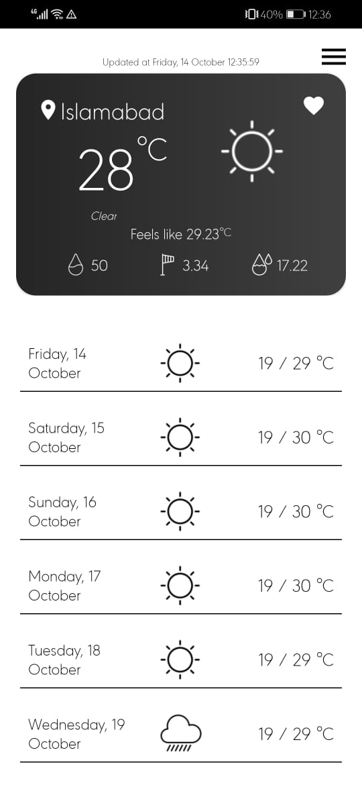

# MyWeatherApp
Overview
Create a weather App which allows you to check local weather, you can also search for
other cities and check the weather, and add that city to your favorite cities list

# Tech Stack

- Kotlin
- MVVM
- HILT Dependency Injection
- Coroutines
- API Integration using Retrofit
- Navigation

## ScreenShots

